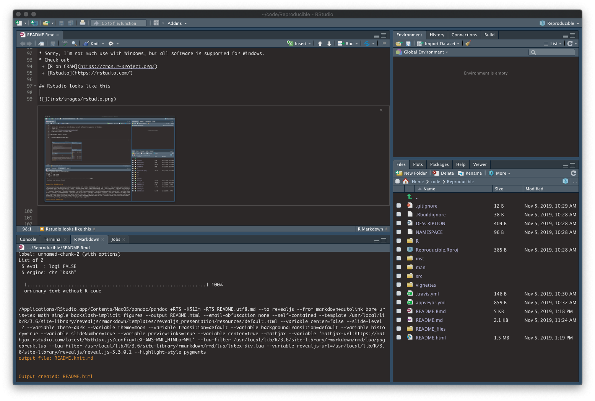
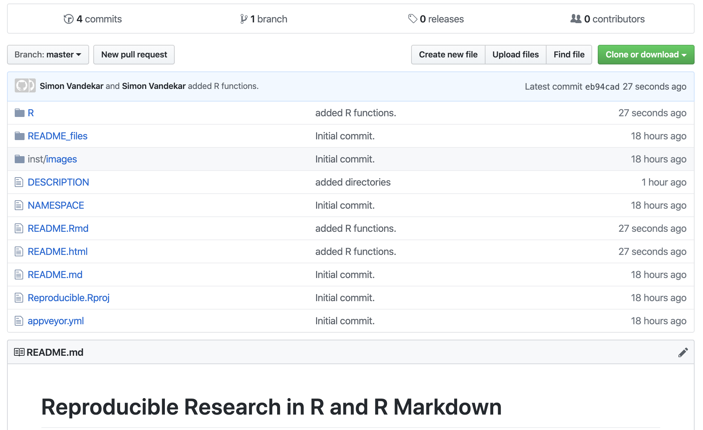
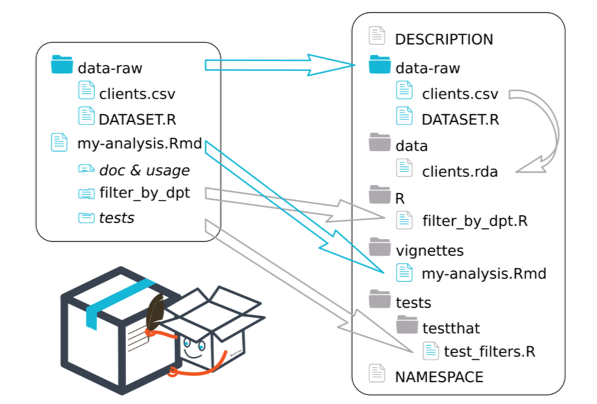

```{r setup, include=FALSE}
knitr::opts_chunk$set(echo = TRUE)
```

# What is Reproducible Research?

## Reproducible research
* "The term __reproducible research__ refers to the idea that the ultimate product of academic research is the paper along with the laboratory notebooks [14] and full computational environment used to produce the results in the paper such as the code, data, etc. that can be used to reproduce the results and create new work based on the research."

* Examples of reproducible research comprise compendia of data, code and text files, often organised around an R Markdown source document or a Jupyter notebook.

-- [Wikipedia](https://en.wikipedia.org/wiki/Reproducibility#Reproducible_research)


## Replicable research (not reproducibility)

* "Research is replicable when an independent group of researchers can copy the same process and arrive at the same results as the original study."
-- [Tim Bock](https://www.displayr.com/replicable-research-care/)
* [Replicability](https://www.biorxiv.org/content/10.1101/066803v1) is a statistical feature (that we're not talking about today).

# Why use R and R Markdown for Reproducible Research?

## Why?!?
 * There are several reasons R is a great statistical language for your reproducible research needs.
   + R Markdown integrates your notes, documentation, math, and code in a single set of documents.
   + Most statisticians use `R` as their primary statistical language -- state-of-the-art methods are available soonest in `R`
   + There are great imaging resources in R freely available via [Neuroconductor](https://neuroconductor.org/)


## Point of This Tutorial
 * These notes are a reproducible R package about making reproducible R packages (sort of like a [coffee table book about coffee tables](https://www.youtube.com/watch?v=3QjTPA-Ib9E)).
 * This tutorial is designed to show you that it is possible to do fully reproducible research using R Markdown and (hopefully) that it is accessible without too much effort.
 * It is a high overview of what can be done with R Markdown, Git, and R.
 * There are links to resources throughout; feel free to explore.

## Not the Point of This Tutorial:

 * This tutorial is not designed to teach you the basics of R (sorry).
 * This is not really going to show you details of how, but you can get some of that from the links.
 * As you're reading, if you have suggestions of good resources, I encourage you to [email me](simon.vandekar@vanderbilt.edu).


# Installing R and Rstudio {.tabset}

## Linux

 * Install `R` from the command line in linux.
 * Then install the version of Rstudio for your system
 * I haven't tested these commands

 ```{bash, eval=FALSE}
 sudo apt -y install r-base # install R
 sudo apt -y install wget # install wget
 wget https://download1.rstudio.org/desktop/bionic/amd64/rstudio-1.2.5019-amd64.deb # install Rstudio
 ```

## Mac OS

 * I like to use [Homebrew](https://brew.sh) for managing software.
 * Be sure to pay attention to Homebrew output to be sure installation completes successfully.
   + Specifically, Homebrew needs to create symlinks and that sometimes fails.
 * xcode command line tools are necessary for developing R packages.
 * Can install R and Rstudio at the command line (after installing homebrew)
```{bash, eval=FALSE}
xcode-select --install # install x-code command line tools
brew install r # install R
brew cask install --appdir=/Applications rstudio # install R-studio (GUI for R)
```

## Windows

* Sorry, I'm not much use with Windows, but all software is supported for Windows.
* Check out
  + [R on CRAN](https://cran.r-project.org/)
  + [Rstudio](https://rstudio.com/)

## Rstudio looks like this



# Reproducible Research using R packages
## Why?!?

 * R packages are what developers use for releasing new statistical software.
 * Turns out, they're super useful for keeping track of your notes and code for research as well.
 * Everything is version controlled with Git and checked using tools in R.
 * Once your project is finalized, your notes and code can be distributed within the R package.
 * Content of R package will serve as basis for your publication.
 * __Important note__: Github repositories are public by default; do not put an unpublished paper in a public repository!

## This Document is an Example of a Reproducible Research R Package

 * This document itself is part of an R package
 * Clone it from git!

```{bash, eval=FALSE}
cd ~/
git clone https://github.com/simonvandekar/Reproducible
```


## Structure of an R package

### An R package is a bunch of functions related to a certain project.



## Structure of an R package

 * `R/` -- directory for R functions that make up
 * `src/` -- directory of C++ functions that you've wrapped into `R` using `Rcpp`
 * `vignettes/` -- directory of one or more Markdown documents to illustrate use of package
 * `README.Rmd` -- the uncompiled version of this document
 * `README.*` -- other compiled versions of this document
 * `DESCRIPTION` -- stuff about package you would need to edit

## Installing an R package from github

 * If someone else has made an R package for their reproducible research and stored it on github you can install it on your system
 * For example, install [this package](https://github.com/simonvandekar/Reproducible):
 
```{r}
devtools::install_github('simonvandekar/Reproducible', force=TRUE) # force just forces reinstall even if there is no update since previous install
```
 

## Your project workflow can map directly onto and R package



# Creating an R package for Reproducible Research


## Writing an R Markdown Document

 * As far as I know, R Markdown can use all the same syntax as regular Markdown. You can type equations using syntax similar to latex.
 * R Markdown documents can be compiled to a github README, html, pdf, word doc, or many other types of documents.
   + Some document formats: github_document, html_document, pdf_document
   + Some presentation formats: ioslides_presentation, slidy_presentation, revealjs::revealjs_presentation
 * Some basic syntax references can be found here
   + [Markdown Basics](https://rmarkdown.rstudio.com/authoring_basics.html)
   + [Mathematics in R Markdown](https://www.calvin.edu/~rpruim/courses/s341/S17/from-class/MathinRmd.html)

## R Markdown Compilation Options

 * There are many options for formatting the output of your markdown document

   + [html options](https://bookdown.org/yihui/rmarkdown/html-document.html)
   + [revealjs options](https://github.com/rstudio/revealjs)

## Writing R (or other) Code in an R Markdown Document

  
```{r, cache=FALSE, message=FALSE, results='hide'}
# THIS IS SOME CODE TO RUN SIMULATIONS FOR A PAPER

library(Reproducible) # load functions from this package!
library(pracma) # for sqrtm
library(sandwich) # for robust covariance matrices
library(lmtest) # for robust tests
set.seed(666)
nsim=2 # low number of sims for this example
alpha=0.05
# controls skewness of gamma
shapes = c(0.5, 10)
ns = c(25, 50, 100, 250, 500, 1000)
SIs = c(0, 0.1, 0.25, 0.4, 0.6)
m1s = c(1,3,5)
m0s = c(2,5)
rhosqs = c(0, .6)
hetero = 1 # x variable that induces heterogeneity. 0 for none
out = expand.grid(shape=shapes, n=ns, m1=m1s, m0=m0s, S=SIs, rhosq=rhosqs)
params = names(out)
out[, c('bias', 'coverage.central', 'coverage.sr', 'width.central', 'width.sr')] = NA
# testing SI=SIs[1]; n=ns[1]; shape=shapes[1]; m1=m1s[1]; m0=m0s[1]; rhosq=rhosqs[2]; hetero=1
for( rhosq in rhosqs){
    for(SI in SIs){
      for(m1 in m1s){
      for(m0 in m0s){
        m = m0 + m1
        # First set of variables are covariates of interest. Next set are nuisance. No intercept
        Vsqrt = rbind(cbind(diag(m1), matrix(sqrt(rhosq/m1/m0), nrow=m1, ncol=m0)), cbind(matrix(sqrt(rhosq/m1/m0), nrow=m0, ncol=m1), diag(m0)))
        Vsqrt = pracma::sqrtm(Vsqrt)$B
        if(hetero){
          mat = diag(m1) - rhosq/m1 * matrix(1, nrow=m1, ncol=m1)
          # For checking my math
          #mat2 = Vsqrt %*% matrix(rnorm(m * 10000), nrow=m)
          # X0 = mat2[(m1+1):m,]
          # X1 = mat2[1:m1,]
          # A and B are classical notation from Boos and Stefanski of components of the sandwich estimator
          A = diag(m1) - matrix(1, nrow=m1, ncol=m1) * rhosq/m1
          X1TDeltaX0X0TX1 = matrix(c(3 * rhosq/m1, rep(rhosq/m1, m1-1)), nrow=m1, ncol=m1)
          B <- if(m1==1) matrix(3) else diag(c(3, rep(1, m1-1)) )
          B = B + rhosq/m0/m1 * (m0 + 2 * m0 * rhosq/m1) * matrix(1, nrow=m1, ncol=m1) - (X1TDeltaX0X0TX1  + t(X1TDeltaX0X0TX1 ) )
          Binv = solve(B)
          beta = rep(c(SI/sqrt(sum(A %*% Binv %*% A)), 0), c(m1, m0) )
        } else {
          beta = rep(c(SI/sqrt(m1 * (1-rhosq)), 0), c(m1, m0)  ) # assumes constant covariance between X1 and X0 variables and independence otherwise cov(X_1) = I, cov(X_0) = I, cov(X_1, X_0) = 1 1^T rho/sqrt(m0 * m1)
        }
        for(n in ns){

          for(shape in shapes){
            sim.func = function(){
              x = matrix(rnorm(n * m), nrow=n, ncol=m ) %*% Vsqrt
              if(hetero){
                # here, the average variance is 1, but the variance depends on the value of x
                y = x %*% beta + rgamma(n, shape = shape, rate = sqrt(shape/ x[,1]^2) ) - sqrt(shape * x[,1]^2) # mean of gamma will be sqrt(shape * x)
              } else {y = x %*% beta + rgamma(n, shape = shape, rate = sqrt(shape) ) - sqrt(shape)}
              x = as.data.frame(x)
              modelfull = lm( as.formula(paste0('y ~ -1 + ', paste0('V', 1:m, collapse='+') )), data=x )
              modelreduced = lm( as.formula(paste0('y ~ -1 + ', paste0('V', (m1+1):m, collapse='+') )), data=x )

              chistat = waldtest(modelreduced, modelfull, vcov=vcovHC(modelfull), test = 'Chisq')
              chi = sqrt(chistat[2,'Chisq'])
              resdf = chistat[2,'Res.Df']
              df = chistat[2,'Df']
              SIhat = sqrt(max((chistat[2,'Chisq'] - df)/resdf, 0) )
              bias = (SIhat - SI) # bias
              CI = ncc.ints(chi, df, alpha=alpha)/sqrt(resdf)
              widths = diff(t(CI))
              c(bias=bias,
                coverage.central=(SI>=CI[1,1] & SI<CI[1,2]),
                #coverage.mdb=(SI>=CI[2,1] & SI<CI[2,2]), # HAS OPTIM ISSUES for large effect and sample sizes, I think
                #coverage.mdr=(SI>=CI[2,1] & SI<CI[2,2]), # Also does
                coverage.sr=(SI>=CI[2,1] & SI<CI[2,2]),
                width.central=widths[1],
                #width.mdb=widths[2],
                #width.mdr=widths[2],
                width.sr=widths[2] ) # was 4, now 3
            }
            cat(paste(shape, n, m1, m0, SI, rhosq, collapse=','), '\t')
            temp = t(replicate(nsim, sim.func()))
            out[which( out$shape==shape & out$n==n & out$m1==m1 & out$m0==m0 & out$S==SI & out$rhosq==rhosq), c('variance', 'bias', 'coverage.central', 'coverage.sr', 'width.central', 'width.sr')] = c(var(temp[,1]), colMeans(temp))
          }
        }
      }
    }
  }
}

```
 
 
 
## This is the code to plot the simulation results. 
```{r, fig.cap="Example plot of simulation results."}
library(lattice)
# setwd('~/Box Sync/work/nonparametric_effect_size'); library(qwraps2); lazyload_cache_labels('graphics-simulations')
   out[,c(1,3:6)] = sapply(names(out)[c(1,3:6)], function(x) as.factor(paste((x), out[,x], sep=' = ') ) )
   trellis.device(color=FALSE, new=FALSE)
    trellis.plot = xyplot(bias ~ n | S * rhosq, data=out[out$m0=='m0 = 2' & out$m1=='m1 = 3' & out$shape=='shape = 10',], type='b', lwd=2,
      ylab='Bias', xlab = 'Sample size', ylim=c(-.15, .15), xlim=range(out$n) + c(-100, 100),
      panel= function(x, y, ...){
        #panel.grid(v=unique(out$ns), h=seq(-.15, .15, by=0.05))
        panel.grid(h=-1, v=-1)
        panel.xyplot(x, y, ..., col='black')
        #panel.abline(h=0, col='black', ...)
      })
    print(trellis.plot)
```


## Updating with Git

 * Now that we've added some simulations, we'll push these changes to github from the shell.
 * Can also do this with mouse clicks using Rstudio.
 
```{bash, eval=FALSE}
git add README.Rmd
git commit -m "Added some simulations and a plot."
git push origin master
```


# Exporting, Documenting, and Compiling Functions

 * There are some R functions that I've already put into the R directory to help me run the simulations.
 * For example, we can open the code [ncc.ints](https://github.com/simonvandekar/Reproducible/blob/master/R/ncc.R) function within this package
```{r, eval=FALSE}
?ncc.ints
```

## Adding functions while you work

 * My nested for loop is pretty hard to read; the simulations could be packaged more neatly.
 * It might make sense to bundle parts of the code together into [components](https://github.com/simonvandekar/Reproducible/blob/master/R/es_sim.R) that are documented functions in this package.
 * Then, they have their own help files and this README stays readable.
 
## Rewritten simulation code
 
```{r, eval=TRUE}

library(Reproducible) # load functions from this package!
library(pracma) # for sqrtm
library(sandwich) # for robust covariance matrices
library(lmtest) # for robust tests
set.seed(666)
nsim=2 # low number of sims for this example
alpha=0.05
# controls skewness of gamma
shapes = c(0.5, 10)
ns = c(25, 50, 100, 250, 500, 1000)
SIs = c(0, 0.1, 0.25, 0.4, 0.6)
m1s = c(1,3,5)
m0s = c(2,5)
rhosqs = c(0, .6)
hetero = 1 # x variable that induces heterogeneity. 0 for none
out = expand.grid(shape=shapes, n=ns, m1=m1s, m0=m0s, S=SIs, rhosq=rhosqs)
params = names(out)
out[, c('bias', 'coverage.central', 'coverage.sr', 'width.central', 'width.sr')] = NA
# testing SI=SIs[1]; n=ns[1]; shape=shapes[1]; m1=m1s[1]; m0=m0s[1]; rhosq=rhosqs[2]; hetero=1
# function that collapses two compiled simulation functions.
sim.func = function(shape, n, m1, m0, S, rhosq, hetero){
              simparameters = simSetup(S=S, m1=m1, m0=m0, rhosq=rhosq, hetero=hetero)
              simFunc(simparameters, shape=shape, n=n, alpha=0.05)
            }
for( rhosq in rhosqs){
    for(SI in SIs){
      for(m1 in m1s){
      for(m0 in m0s){
        for(n in ns){
          for(shape in shapes){
            cat(paste(shape, n, m1, m0, SI, rhosq, collapse=','), '\t')
            temp = t(replicate(nsim, sim.func(shape, n, m1, m0, SI, rhosq, hetero)))
            out[which( out$shape==shape & out$n==n & out$m1==m1 & out$m0==m0 & out$S==SI & out$rhosq==rhosq), c('variance', 'bias', 'coverage.central', 'coverage.sr', 'width.central', 'width.sr')] = c(var(temp[,1]), colMeans(temp))
          }
        }
      }
    }
  }
}


```
 


# Other stuff

## Disclaimers

 * I am not an expert in reproducible software and am actively learning the best way to do reproducible research using R Markdown, Git, and Docker.
 * The R Markdown document is conducive with other languages, such as Python, Bash, and Stan.
 * There are other tools (e.g. Jupyter Notebook) that have similar functionality and __may__ be better suited for other programming languages.

## Important Resources That I Have Neglected

 * There are many important tools that I have neglected to talk about because I have not learned them myself (embarrassingly ; e.g. `tidyverse`, `testthat`).

 * [tidyverse](https://www.tidyverse.org/)
 * [CRAN Reproducible Research](https://cran.r-project.org/web/views/ReproducibleResearch.html)

## Your input

 * If you have any suggestions about useful links on this material, contact me
   + simon.vandekar@vanderbilt.edu

